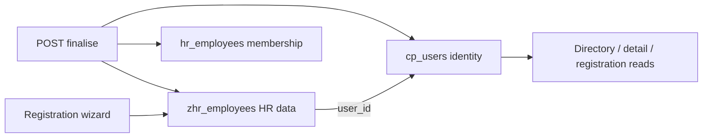

# Sprint audit — employee registration wizard

**Last updated:** 2026-05-21  
**Branch:** `feature/uplift`  
**Status:** Implementation complete; deploy verification pending.

---

## Executive summary

The registration wizard backend is **implemented** on `feature/uplift`:

- Schema in **tvs-sqlscript** (`20260521193953_AddEmployeeRegistration`)
- Wizard API under `/api/v1/employees/*` (check-user, draft, steps, finalise, sub-resources)
- **Direct `cp_users` provisioning** on finalise (`cp_users`, `cp_login_settings`, `cp_user_locations`, `hr_employees`) — no Trovesuite auth package required
- Identity (**name, work email, phone**) lives in **`core_platform.cp_users`**; `zhr_employees` stores **`user_id` only** after finalise (draft fields cleared)
- Directory/detail **reads join `cp_users`** when `user_id` is set
- **`RequiresZelosHrPermission`** on all employee controller routes (`permission-zeloshr-employee-*`)
- **43** unit tests passing via `./scripts/compose.sh test`

---

## Done checklist

| Area | Status |
|------|--------|
| tvs-sqlscript migration + education/certifications/wizard documents | Done |
| `ICpUserRepository` read + `ProvisionEmployeeUserAsync` | Done |
| `IFileStorageService` (Azure + local dev) | Done |
| Wizard endpoints | Done |
| Finalise creates/links platform user + `hr_employees` | Done |
| No identity duplication on `zhr_employees` after finalise | Done |
| RBAC on wizard + directory + CRUD | Done |
| `EmployeeRegistrationTests` + sub-resources tests | Done |
| Compose migrate/test scripts | Done |
| Demo seed `cp_users` + `user_id` link only | Done |

---

## Remaining (post-sprint / ops)

| Item | Notes |
|------|--------|
| Docker API rebuild | Prior build failed (containerd); run `docker compose build api` |
| DB migrate on each env | `./scripts/compose.sh migrate` |
| Legacy `POST /employees` | Still first/last + Ghana Card path (parallel to wizard) |
| `PATCH /employees/{id}/status` | Not added; use `lifecycle-state` |
| Full platform provision | No groups/password/subscription chain yet — extend if JWT login fails |
| E2E / integration tests | Unit tests only |
| `SPRINT_AUDIT` historical sections below | Kept for reference; superseded by summary above |

---

## Architecture (identity)

**Insert order (from `tvs-sqlscript-backup`):** tenants → resource types → permissions → roles → role_permissions → apps; user rows: `cp_users` → `cp_login_settings` → `cp_user_locations` → `hr_employees`.

---

## Historical discovery notes (2026-05-19)

The sections below document the pre-implementation audit. Many items are now resolved.

### Original gap summary

The uplifted API initially matched the legacy directory model. The registration UI required `full_name`, `user_id`, draft wizard, compensation, and blob-backed documents. Schema changes landed in **tvs-sqlscript** first.

See git history on `feature/uplift` and `feat/zeloshr-ef-schema-and-sprint-seeds` for migration files.

---

## Appendix

- **Tests:** `./scripts/compose.sh test` → 43 passing
- **Local stack:** `./scripts/compose.sh dev` — see [LOCAL_DEV.md](LOCAL_DEV.md)
- **Platform users:** [TROVESUITE.md](TROVESUITE.md)
