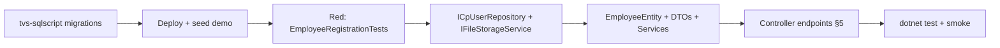

# Sprint audit — employee registration wizard

**Date:** 2026-05-19  
**Branch audited:** `feature/uplift`  
**Scope:** Section 0 discovery only — no implementation in this commit.

---

## Executive summary

The uplifted API (`ZelosHrDbContext`, repository pattern, `ZEL-####` codes) matches the **legacy directory model** (split names, Ghana Card, `lifecycle_state`). The **registration UI spec** requires a different `zhr_employees` shape (`full_name`, `user_id` → `cp_users`, draft wizard, compensation, blob-backed documents). **Schema changes must land in `tvs-sqlscript` first**; the API has no `ICpUserRepository`, no `IFileStorageService`, and no registration endpoints yet.

---

## 1. `zhr_*` tables — migrations vs UI

Source of truth: `tvs-sqlscript` migration `20260520095923_ZelosHrAppTables.cs` + `Entities/ZelosHrEntities.cs`.

| Table | In migration? | UI / sprint need | Gap |
|-------|---------------|------------------|-----|
| `zhr_employees` | Yes | Full registration profile + draft | **Large column gap** (see §2) |
| `zhr_departments` | Yes | Department picker | OK |
| `zhr_branches` | Yes | Optional location | OK (spec uses `work_location` on employee, not only branch) |
| `zhr_employee_documents` | Yes | Per-employee uploads with `blob_url` | **Wrong shape** — metadata only, no blob URL / soft delete |
| `zhr_employee_education` | **No** | Step 3 education | **Create migration** |
| `zhr_employee_certifications` | **No** | Step 3 certifications | **Create migration** |
| `zhr_audit_logs`, `zhr_lifecycle_events`, attendance, leave, recruitment, onboarding, performance, disciplinary | Yes | Other modules | OK for uplift; not registration-critical |

**Separate schema:** `human_resource.hr_employees` (`user_id` → `cp_users`) exists from `Initial` HR migration. It is **not** the same as `zeloshr.zhr_employees`. Registration spec links `zhr_employees.user_id` → `cp_users`; that FK does **not** exist on `zhr_employees` today.

**Demo data:** `Sql/Seeds/05_zeloshr_demo.sql` exists — 10+ employees with `ZEL-####` codes under `demo-tenant` / `demo-org`. Satisfies “≥2 demo employees” once seed flag is used.

---

## 2. `zhr_employees` — deployed columns vs registration spec (§2.2)

### Present in DB / EF (both tvs-sqlscript and ZelosHR.Api `EmployeeEntity`)

`id`, `employee_code`, `tenant_id`, `org_id`, `first_name`, `middle_name`, `last_name`, `date_of_birth`, `gender`, `nationality`, `ghana_card_number`, `personal_email`, `personal_phone`, `residential_address`, `ghana_post_gps`, `lifecycle_state`, `job_title`, `department_id`, `branch_id`, `employment_type`, `manager_id`, `employment_status`, `contract_type`, `probation_end_date`, `employment_start_date`, `is_deleted`, `created_at`, `updated_at`.

### Required by UI but **missing** from migration

| Group | Missing columns |
|-------|-----------------|
| Identity / platform | `user_id`, `full_name`, `is_draft`, `lifecycle_status` (or rename/replace `lifecycle_state`), `created_by`, `updated_by` |
| Personal | `nationality_id_type`, `id_number`, `work_email`, `phone`, `linkedin_url`, `state`, `profile_photo_url` |
| Employment | `work_arrangement`, `work_location`, `pay_grade`, `start_date` (vs `employment_start_date`), `working_hours`, `notice_period`, `reports_to_id`, `dotted_line_manager_id` |
| Compensation | `gross_salary`, `pay_frequency`, `annualized_cost`, `salary_effective_from`, `currency`, `ssnit_number`, `tin_number`, `tier2_pension_provider`, `tier3_pension_provider`, `payment_method`, `bank_account_number`, `mobile_money_number` |

### Naming / semantics mismatches (need migration + API alignment)

| Spec | Current | Action |
|------|---------|--------|
| `full_name` (single field) | `first_name` / `middle_name` / `last_name` | Add `full_name`; migrate or compute for reads; stop split on **create** |
| `gps_address` | `ghana_post_gps` | Rename or map |
| `id_number` + `nationality_id_type` | `ghana_card_number` only | Generalize ID fields; revisit unique index on `ghana_card_number` |
| `lifecycle_status` + `is_draft` | `lifecycle_state` only | Add draft flag + status enum values |
| `reports_to_id` | `manager_id` | Rename or alias |
| `start_date` | `employment_start_date` | Rename or alias |
| `user_id` → `cp_users` | None on `zhr_employees` | Add nullable FK; link on import/finalise |

**Recommended tvs-sqlscript migrations (ordered):**

1. `AddEmployeeRegistrationFields` — columns in §2.2 + renames/index updates  
2. `AddEmployeeEducationTable`  
3. `AddEmployeeCertificationsTable`  
4. `AlterEmployeeDocumentsForBlobStorage` — `blob_url`, `content_type`, `file_size_bytes`, `uploaded_by` (uuid), `is_deleted`; drop or keep denormalized `employee_full_name` per product choice  

---

## 3. `zhr_employee_documents` — current vs spec

| Field | Migration / API today | Registration spec |
|-------|----------------------|---------------------|
| Storage | Metadata only (`document_name`, `file_size_kb`, `status`) | `blob_url`, Azure upload |
| Size | `file_size_kb` (int) | `file_size_bytes` (bigint) |
| Upload actor | `uploaded_by` string | `uploaded_by` uuid |
| Delete | `status` | `is_deleted` soft delete |
| Types | — | `content_type` |

`DocumentsService` creates rows **without** file upload or blob URL — placeholder for HR document **listing**, not wizard uploads.

---

## 4. `cp_users` — read-only “check before create”

Mapped in HR DbContext snapshot as `core_platform.cp_users` (`ExcludeFromMigrations` — owned by CorePlatform).

**Actual columns (EF `User` entity):**

| Spec name | DB column | Notes |
|-----------|-----------|--------|
| `id` | `id` | **`text`**, not `uuid` — DTOs must use `string` or parse carefully |
| `full_name` | `fullname` | Snake: `fullname` |
| `email` | `email` | Use for `GET .../check-user?email=` |
| `phone` | `contact` | Not `phone` |
| `tenant_id` | `tenant_id` | Scope all queries |
| `is_active` | `is_active` | On `TenantScopedEntity` / snapshot |
| `created_at` | `cdatetime` | Not `created_at` |
| `org_id` | — | **Not on `cp_users`**; org context comes from request headers (`X-Org-Id`) and `zhr_employees.org_id` |

**Not in ZelosHR.Api today:** `ICpUserRepository`, `CpUserDto`, any EF entity/DbSet for `cp_users`. Must add read-only repository (AsNoTracking, tenant-scoped email lookup).

**Write path:** Never INSERT/UPDATE `cp_users` from ZelosHR — use **Trovesuite.Package** user creation on `FinaliseAsync` (per spec). `hr_employees` link table may also need coordination with platform team.

---

## 5. ZelosHR.Api — employee module vs UI

| Area | Current state |
|------|----------------|
| Persistence | `EmployeeEntity` mirrors legacy split-name schema |
| Create | `POST /api/v1/employees` — `CreateEmployeeControllerWriteDto` with `FirstName` / `LastName`, required Ghana Card, all personal fields at once |
| Code format | `ZEL-{seq:D4}` in `EmployeesService` — **matches spec** |
| Full name in reads | Built via `NameFormatting.BuildFullName` — not stored |
| Endpoints | Directory (`/directory/*`), CRUD, profile/employment PATCH — **no** `check-user`, `draft`, `finalise`, `photo`, education, certifications, per-employee `documents` upload |
| Permissions | Controllers do **not** use `[HasPermission(...)]` yet; seeds use `permission-zeloshr-employee-*`, not `permission-msg-employees-*` from spec |
| `cp_users` | No reads |
| Tests | 27 `[Fact]` methods across 9 files — **no** `EmployeeRegistrationTests.cs` |

**Files (employees):** controller, `EmployeesService` (+ partial), directory service, DTOs, `IEmployeeRepository` + `EmployeeRepository` under `Persistence/Repositories/` (no `EmployeesRepository.cs` at entity layer — by design).

---

## 6. Azure Blob / file storage

| Check | Result |
|-------|--------|
| `Azure.Storage.Blobs` in `ZelosHR.Api.csproj` | **Not referenced** |
| `IFileStorageService` in app | **Not found** |
| Trovesuite | `IStorageService` on `TrovesuitePlatformController` — **read URL / SAS** (`POST /api/v1/platform/storage/file-url`), not employee upload pipeline |
| `docs/TROVESUITE.md` | Documents package storage with Managed Identity |
| Documents module | DB metadata only |

**Sprint work:** Add `IFileStorageService` + `AzureBlobStorageService` (or extend Trovesuite storage if upload API exists in package), `appsettings` `AzureStorage` section, register `BlobServiceClient`. Profile photos + employee documents must call upload before persisting URL.

---

## 7. Tests

| Category | Count / status |
|----------|----------------|
| Existing unit tests | **27** facts (Employees 15, Departments 3, Branches 1, Org 2, Lifecycle 2, Audit 1, Shared 2, Directory demo 1) |
| `EmployeeRegistrationTests` | **Missing** (spec §4.1) |
| Last known CI/local | **30 passing** on uplift (per `ARCHITECTURE_AUDIT.md`); **not re-run** this session — `dotnet` unavailable in shell, Docker daemon down |
| API smoke | **API not running** on `:8000` — navigation/Swagger not verified |

**Missing test areas for sprint:** `CheckUser_*`, draft create, partial PATCH steps, compensation masking, document size validation, finalise + cp_users link, self report-to guard.

---

## 8. RBAC seeds (`tvs-sqlscript`)

| File | Status |
|------|--------|
| `01_resource_types.sql` | ZelosHR resource types including `rt-zeloshr-employee` |
| `02_permissions.sql` | `permission-zeloshr-employee-get/create/update` — **not** `permission-msg-employees-read/write/admin` from spec |
| `03_roles.sql` | Present (not re-read line-by-line) |
| `05_zeloshr_demo.sql` | **Present** — branches, departments, 10+ employees, related module seeds |

**Decision needed:** Align controller attributes with existing `permission-zeloshr-*` IDs **or** add new permission IDs + seed migration (idempotent `ON CONFLICT`).

---

## 9. Reference repos

| Repo | Status |
|------|--------|
| `../tvs-sqlscript` | Available — primary schema audit above |
| `../tvs-mystoreguard-bk` | **Not found** under `deladetech/` (FastAPI mirror pattern skipped) |
| Trovesuite.Package | Referenced v1.0.0; local `~/.nuget` path not verified |

---

## 10. tvs-sqlscript checklist (Section 6)

- [ ] `zhr_employees` — all §2.2 columns → **`AddEmployeeRegistrationFields`**
- [ ] `zhr_employee_education` → **`AddEmployeeEducationTable`**
- [ ] `zhr_employee_certifications` → **`AddEmployeeCertificationsTable`**
- [ ] `zhr_employee_documents` — blob + soft delete → **`AlterEmployeeDocumentsForBlobStorage`**
- [ ] Permissions — confirm `permission-zeloshr-employee-*` vs spec `permission-msg-employees-*`
- [x] `05_zeloshr_demo.sql` — demo employees exist (re-link to `cp_users` after `user_id` column added)

Deploy before API work:

```bash
cd ../tvs-sqlscript
dotnet build
TVS_SEED_ZELOSHR_DEMO=1 dotnet run --project src/Trovesuite.Database.Runner -- \
  localhost 5431 user password zeloshrdb deploy
```

---

## 11. Recommended sprint sequence



1. **tvs-sqlscript** — migrations + EF entities in HumanResource project  
2. **ZelosHR.Api** — align `EmployeeEntity`, repositories, DTOs (`full_name`, draft flags)  
3. **TDD** — `EmployeeRegistrationTests.cs` (red → green)  
4. **Integrations** — `ICpUserRepository`, Azure blob uploads, Trovesuite user create on finalise  
5. **Controllers** — wizard routes; wire permissions consistently  
6. **Verify** — build, 0 warnings, all tests, navigation/Swagger parity  

---

## 12. Risks / decisions

1. **`cp_users.id` is `text`** — spec uses `Guid`; use string IDs or explicit conversion at boundaries.  
2. **Two employee tables** — `hr_employees` vs `zhr_employees`; clarify whether finalise writes both.  
3. **Breaking change** — directory/search today sort on `last_name`; `full_name` migration affects indexes and DTOs.  
4. **Permission naming** — avoid duplicating conflicting permission IDs in seeds.  
5. **Existing `Documents` module** — merge with per-employee upload endpoints or keep separate admin vs wizard paths.  
6. **CI** — `GITHUB_PACKAGES_TOKEN` still required for Trovesuite.Package on PR builds.

---

## Appendix — solution inventory (Section 0)

- **C# files in `app/src`:** 129  
- **EF context:** `Persistence/ZelosHrDbContext.cs` (not `AppDbContext`)  
- **Employee persistence:** `Persistence/Repositories/EmployeeRepository.cs` implements `IEmployeeRepository`  
- **Embedded SQL in API:** `app/src/Database/Migrations/*.sql` — legacy; **disabled** when `App__RunDatabaseMigrations=false`  
- **Packages:** EF Core 10, Npgsql, EFCore.NamingConventions, Trovesuite.Package — **no** Azure.Storage.Blobs  
